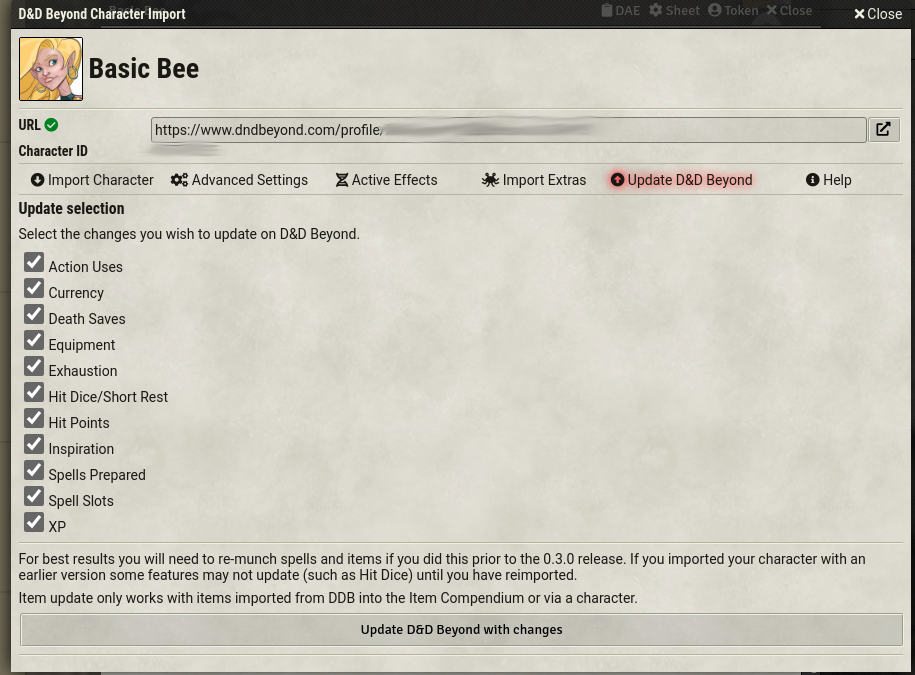
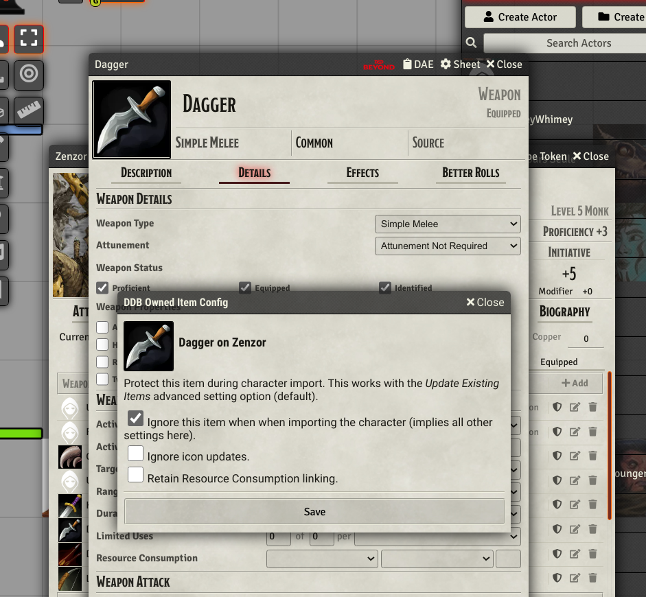
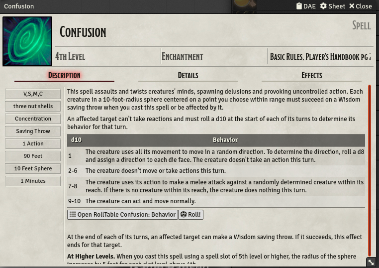
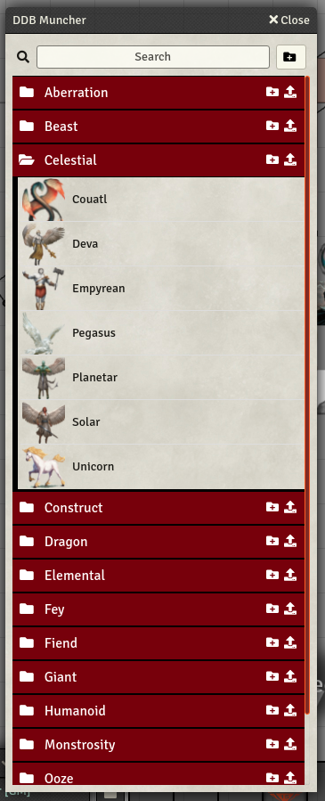

# D&D Beyond Importer

&query=assets%5B0%5D.download_count&url=https%3A%2F%2Fapi.github.com%2Frepos%2FMrPrimate%2Fddb-importer%2Freleases%2Flatest)

Integrate your dndbeyond.com characters into Foundry Virtual Tabletop.

This module:
* Import your DDB characters into Foundry, and sync changes back!
* Import a characters extras such as Wildshapes or beast companions.
* Import spells and items.
* Import Monsters and NPCs.
* [Patreon](https://patreon.com/mrprimate) supporters can sync limited character changes back to DDB.

In addition you can:

- Use the built in dictionary to get a large icon coverage during import.
- Use supplied SRD items where available.
- Choose to use matching SRD icons.
- Apply effects from DAE or DAE SRD.
- Attempt to auto-generate effects for items.

## Examples

### Import Things!

### Update back to D&DBeyond

### Exclude Items from Update

### Generate Roll Tables

### Encounter Muncher

### Compendium Folders Module Support

## What's the catch?

Calls to dndbeyond are proxied to provide authentication and to bypass CORS checks.

The proxy calls dndbeyond with your credentials to fetch your data.

To get all your spells and do bulk importing you need to set the Cobalt Cookie setting to the value of your D&DBeyond `CobaltSession` cookie. See my helper [Chrome extension](https://github.com/mrprimate/ddb-importer-chrome) to help.

Do **NOT** give your cookie to other people, this is like handing out a password to your dndbeyond account.

We do not store your cobalt cookie on the server.

To logout/invalidate these credentials log out of your D&DBeyond Session.

If you wish to host your own proxy, please see [ddb-proxy](https://github.com/mrprimate/ddb-proxy), help is not available for this mode, and not all functionality is available.

## Support

Where can you support me? See my [Patreon](https://patreon.com/mrprimate).

You can log bugs here, or mention them in the [Discord channel](https://discord.gg/WzPuRuDJVP).

## Pre-requisites and recommendations

I'd strongly recommend installing:

- [Magic Items](https://foundryvtt.com/packages/magicitems/) for attaching spells to magic items
- [DAE](https://foundryvtt.com/packages/dae/) or [Skill Customization for D&D5E](https://foundryvtt.com/packages/skill-customization-5e/) for skill bonuses
- [Link Item and Resource DnD5e module](https://foundryvtt.com/packages/link-item-resource-5e )
- [DFreds Convenient Effects](https://foundryvtt.com/packages/dfreds-convenient-effects)

If you want to increase automation for spell effects you will need:
- [Midi-QOL](https://foundryvtt.com/packages/midi-qol/), [About Time](https://foundryvtt.com/packages/about-time), [Times Up](https://foundryvtt.com/packages/times-up/).
- For the best results also use [Advanced Macros](https://foundryvtt.com/packages/advanced-macros), [Active Token Effects](https://foundryvtt.com/packages/ATL) and [Token Magic FX](https://foundryvtt.com/packages/tokenmagic).

## SRD Import Notes

Some detail will be lost:

* Any auto configuration of Magic Item spells
* Any custom damage modifications from things like Fighting Styles and Improved Divine Smite

Some details are updated, if applicable:

* number of uses
* quantity of items
* attuned status
* equipped status
* resource tracking
* spell preparation status
* proficiency

## Configuration

### Avatar upload directory

Sets the icon directory where you are storing your avatar image uploads. It's relative to the Foundry `/Data` directory, please do not add a leading or trailing slash to this path.

Examples:

- `img/uploads` references to `[Foundry]/Data/img/uploads`
- `uploads` references to `[Foundry]/Data/uploads`
- `` references to `[Foundry]/Data` - not recommended

# FAQ

See [FAQ!](./FAQ.md)
